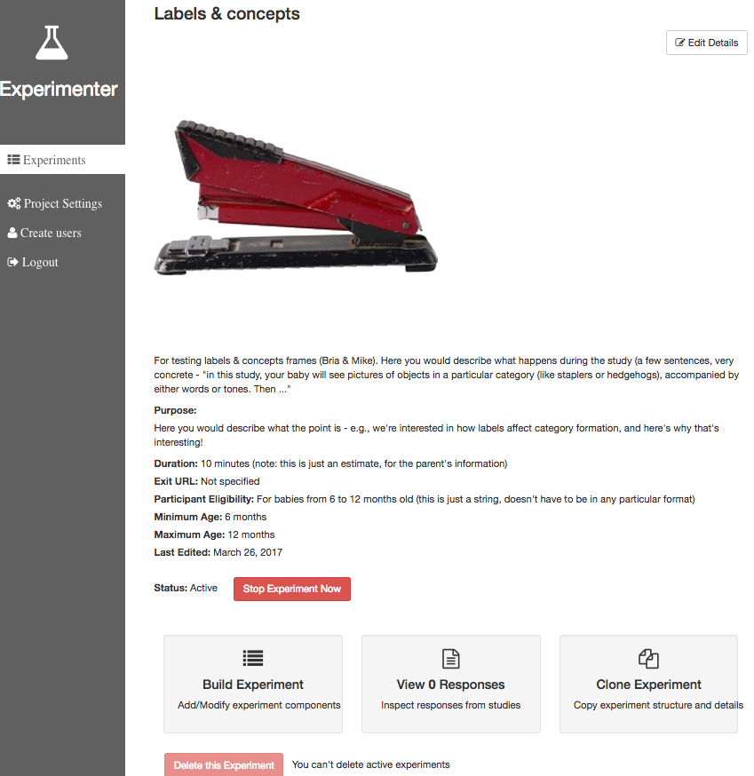
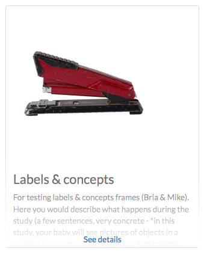
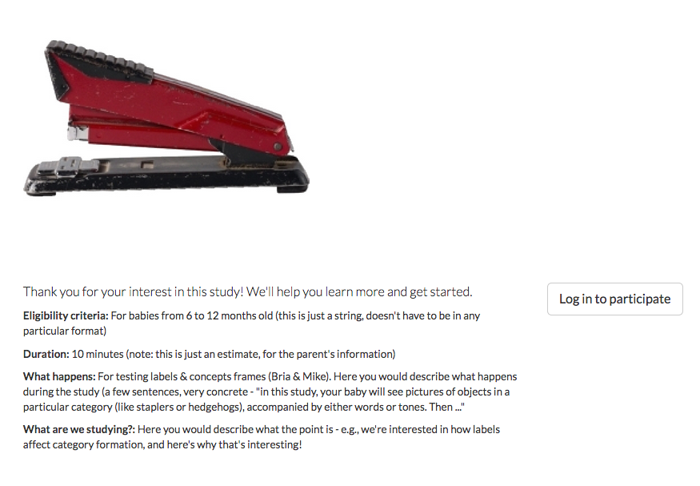

# Building an Experiment

### Prerequisites

If you are unfamiliar with the JSON format, you may want to spend a couple minutes reading the introduction here: 
[http://www.json.org/](http://www.json.org/).

Additionally, we use JSON Schema heavily throughout this project. The examples [here](http://json-schema.org/examples.html) 
are a great place to learn more about this specification.

A helpful resource to check your JSON Schema for simple errors like missing or extra commas, unmatched braces, etc. is [jsonlint](http://jsonlint.com/).

### Creating a new study and setting study details

You can click 'New Experiment' to get started working on your own study, or clone an existing study to copy its experiment definition. 

Here is the 'experiment detail view' for an example study. The primary purpose of the details you can edit in this view is to display the study to parents who might be interested in participating. You can select a thumbnail image, give a brief description of the study (like you would to a parent on the phone or at the museum if you were recruiting), and define an age range or other eligibility criteria. The "Participant Eligibility" string is just a description and can be in any format you want (e.g. "for girls ages 3 to 5" is fine) but parents will only see a warning about study eligibility based on the minimum/maximum ages you set. Those can be in months, days, or years. Parents who try to participate will see a warning if their child is younger (asking them to wait if they can) or older (letting them know we won't be able to use their data) but are not actually prevented from participating.

You won't see your study on Lookit until it's started (made active). You can start/stop your study here on the detail page.



Here are the corresponding study views on Lookit:





> Try it yourself: Make your own study on staging-experimenter, choose a thumbnail, and enter a description. Look on Lookit: you don't see it, because you haven't started the study yet. Start the study from Experimenter and refresh Lookit: there it is! 

Your study's unique ID can be seen in the URL as you view it from either Experimenter or Lookit.

### Experiment structure

To define what actually happens in your study, go to "Build Experiment" at the bottom of the detail page. In this "experiment editor" view, Experimenter provides an interface to define the structure of an experiment using a JSON document. This is composed of two segments:

- **structure**: a definition of the **frames** you want to utilize in your experiment. This must take the form of a JSON object, i.e. a set of key/value pairs.
- **sequence**: a list of keys from the **structure** object. These need not be unique, and items from **structure** may be repeated. This determines the order that **frames** in your experiment will be shown.

> *Note:* the term **frame** refers to a single segment of your experiment. Examples of this might be: a consent form, 
a survey, or some video stimulus. Hopefully this idea will become increasing clear as you progress through this guide.

To explain these concepts, let's walk through an example:

```json
{
    "frames": {
        "intro-video": {
            "kind": "exp-video",
            "sources": [
                {
                    "type": "video/webm",
                    "src": "https://s3.amazonaws.com/exampleexp/my_video.webm"
                },
                {
                    "type": "video/ogg",
                    "src": "https://s3.amazonaws.com/exampleexp/my_video.ogg"
                },
                {
                    "type": "video/mp4",
                    "src": "https://s3.amazonaws.com/exampleexp/my_video.m4v"
                }
            ]
        },
        "survey-1": {
            "formSchema": "URL:https://s3.amazonaws.com/exampleexp/survey-1.json",
            "kind": "exp-survey"
        },
        "survey-2": {
            "formSchema": "URL:https://s3.amazonaws.com/exampleexp/survey-2.json",
            "kind": "exp-survey"
        },
        "survey-3": {
            "formSchema": "URL:https://s3.amazonaws.com/exampleexp/survey-3.json",
            "kind": "exp-survey"
        },
        "survey-randomizer": {
            "options": [
                "survey-1",
                "survey-2",
                "survey-3"
            ],
            "sampler": "random",
            "kind": "choice"
        },
        "exit-survey": {
            "formSchema": "URL:https://s3.amazonaws.com/exampleexp/exit-survey.json",
            "kind": "exp-survey"
        }
    },
    "sequence": [
        "intro-video",
        "survey-randomizer",
        "exit-survey"
    ]
}

```

This JSON document describes a fairly simple experiment. It has three basic parts (see 'sequence'):

1. intro-video: A short video clip that prepares participants for what is to come in the study. Multiple file formats
 are specified to support a range of web browsers.
2. survey-randomizer: A **frame** that randomly selects from one of the three 'options', in this case 'survey-1', 
  'survey-2', or 'survey-3'. The `"sampler": "random"` setting tells Experimenter to simply pick of of the options at 
  random. Other supported options are described [here](http://centerforopenscience.github.io/exp-addons/modules/randomizers.html).
3. exit-survey: A simple post-study survey. Notice for each of the **frames** with `"type": "exp-survey"` there is 
  a `formSchema` property that specifies the URL of another JSON schema to load. This corresponds with the input data 
  expected by [Alpaca Forms](http://www.alpacajs.org/documentation.html). An example of one of these schemas is below:
  
```json
{
    "schema": {
        "title": "Survey One",
        "type": "object",
        "properties": {
            "name": {
                "type": "string",
                "title": "What is your name?"
            },
            "favColor": {
                "type": "string",
                "title": "What is your favorite color?",
                "enum": ["red", "orange", "yellow", "green", "blue", "indigo", "violet"]
            }
        }
    }
}```


### A Lookit study schema

A typical Lookit study might contain the following frame types:

1. exp-video-config
2. exp-video-consent
3. exp-lookit-text
4. exp-lookit-preview-explanation
5. exp-video-preview
6. exp-lookit-mood-questionnaire
7. exp-video-config-quality
8. exp-lookit-instructions
9. [Study-specific frames, e.g. exp-lookit-geometry-alternation, exp-lookit-story-page, exp-lookit-preferential-looking, exp-lookit-dialogue-page; generally, a sequence of these frames would be put together with a randomizer]
10. exp-lookit-exit-survey

For now, before any fullscreen frames, a frame that extends exp-frame-base-unsafe (like exp-lookit-instructions) needs to be used so that the transition to fullscreen works smoothly. A more flexible way to achieve this behavior is in the works!

### Randomizer frames

Generally, you'll want to show slightly different versions of the study to different participants: perhaps you have a few different conditions, and/or need to counterbalance the order of trials or left/right position of stimuli. To do this, you'll use a special frame called a **randomizer** to select an appropriate sequence of frames for a particular trial. A randomizer frame can be automatically expanded to a list of frames, so that for instance you can specify your 12 looking-time trials all at once.

For complete documentation of available randomizers, see [http://centerforopenscience.github.io/exp-addons/modules/randomizers.html](http://centerforopenscience.github.io/exp-addons/modules/randomizers.html).

To use a randomizer frame, you set `"kind"` to `"choice"` and `"sampler"` to the appropriate type of randomizer. The most common type of randomizer you will use is called [random-parameter-set](http://centerforopenscience.github.io/exp-addons/classes/randomParameterSet.html). 

To select this randomizer, you need to define a frame that has the appropriate `"kind"` and `"sampler"`:

```json

"frames": {
    "test-trials": {
        "sampler": "random-parameter-set",
        "kind": "choice",
        "id": "test-trials",
        ...
    }
}
```

There are three special properties you need to define to use `random-parameter-set`: `frameList`, `commonFrameProperties`, and `parameterSets`. 

`frameList` is just what it sounds like: a list of all the frames that should be generated by this randomizer. Each frame is a JSON object just like you would use in the overall schema, with two differences:

- You can define default properties, to share across all of the frames generated by this randomizer, in the JSON object `commonFrameProperties` instead, as a convenience.

- You can use placeholder strings for any of the properties in the frame; they will be replaced based on the values in the selected `parameterSet`.

`parameterSets` is a list of mappings from placeholder strings to actual values. When a participant starts your study, one of these sets will be randomly selected, and any parameter values in the `frameList` (including `commonFrameProperties`) that match any of the keys in this parameter set will be replaced.

Let's walk through an example of using this randomizer. Suppose we start with the following study JSON schema:

```json
{
    "frames": {
       "instructions": {
           "id": "text-1",
           "blocks": [
               {
                   "text": "Some introductory text about this study."
               },
               {
                   "text": "Here's what's going to happen! You're going to think about how tasty broccoli is."
               }
           ],
           "showPreviousButton": false,
           "kind": "exp-lookit-text"
       },
       "manipulation": {
           "id": "text-2",
           "blocks": [
               {
                   "text": "Think about how delicious broccoli is."
               },
               {
                   "text": "It is so tasty!"
               }
           ],
           "showPreviousButton": true,
           "kind": "exp-lookit-text"
       },
       "exit-survey": {
            "debriefing": {
                "text": "Thank you for participating in this study! ",
                "title": "Thank you!"
            },
            "id": "exit-survey",
            "kind": "exp-lookit-exit-survey"
        }
    },
    "sequence": [
        "instructions",
        "manipulation",
        "exit-survey"
    ]
}
```

But what we really want to do is have some kids think about how tasty broccoli is, and others think about how yucky it is! We can use a `random-parameter-set` frame to replace both text frames:

```

{
    "frames": {
        "instruct-and-manip": {
            "sampler": "random-parameter-set",
            "kind": "choice",
            "id": "instruct-and-manip",
            "frameList": [
                {
                   "blocks": [
                       {
                           "text": "Some introductory text about this study."
                       },
                       {
                           "text": "INTROTEXT"
                       }
                   ],
                   "showPreviousButton": false
                },
                {
                   "blocks": [
                       {
                           "text": "MANIP-TEXT-1"
                       },
                       {
                           "text": "MANIP-TEXT-2"
                       }
                   ],
                   "showPreviousButton": true
               }
            ],
            "commonFrameProperties": {
                "kind": "exp-lookit-text"
            },
            "parameterSets": [
                {
                    "INTROTEXT": "Here's what's going to happen! You're going to think about how tasty broccoli is.",
                    "MANIP-TEXT-1": "Think about how delicious broccoli is.",
                    "MANIP-TEXT-2": "It is so tasty!"
                },
                {
                    "INTROTEXT": "Here's what's going to happen! You're going to think about how disgusting broccoli is.",
                    "MANIP-TEXT-1": "Think about how disgusting broccoli is.",
                    "MANIP-TEXT-2": "It is so yucky!"
                }
            ]
        },
       "exit-survey": {
            "debriefing": {
                "text": "Thank you for participating in this study! ",
                "title": "Thank you!"
            },
            "id": "exit-survey",
            "kind": "exp-lookit-exit-survey"
        }
    },
    "sequence": [
        "instruct-and-manip",
        "exit-survey"
    ]
}
```

Notice that since both of the frames in the `frameList` were of the same kind, we could define the kind in `commonFrameProperties`. We no longer define `id` values for the frames, as they will be automatically identified as `instruct-and-manip-1` and `instruct-and-manip-2`.

If we wanted to have 75% of participants think about how tasty broccoli is, we could also weight the parameter sets by providing the optional parameter `"parameterSetWeights": [3, 1]"` to the randomizer frame. One use of this function is to stop testing conditions that you already have enough children in as data collection proceeds.

### Testing your study

Experimenter has a built-in tool that allows you to try out your study. However, some functionality may not be exactly the same as on Lookit. We recommend testing your study from Lookit, which will be how participants experience it.

### Experiment data

You can see and download collected data from sessions marked as 'completed' (user filled out the exit survey) directly from the Experimenter application. 

You can also download JSON study or accounts data from the command line using the python script [experimenter.py](https://github.com/CenterForOpenScience/lookit/blob/develop/scripts/experimenter.py) ([description](https://github.com/CenterForOpenScience/lookit/pull/85)); you'll need to set up a file config.json with the following content:

```json
{
    "host": "https://staging-metadata.osf.io",
    "namespace": "lookit",
    "osf_token": "YOUR_OSF_TOKEN_HERE"
}

```

You can create an OSF token for the staging server [here](https://staging.osf.io/settings/tokens/). 

The collection name to use to get study session records is `session[STUDYIDHERE]s`, e.g. `session58d015243de08a00400316e0s`.

The data saved when a subject participates in a study varies based on how that experiment is defined. The general structure for this **session** data is:

```json
{
    "type": "object",
    "properties": {
        "profileId": {
            "type": "string",
            "pattern": "\w+\.\w+"
        },
        "experimentId": {
            "type": "string",
            "pattern": "\w+"
        },
        "experimentVersion": {
            "type": "string"
        },
        "completed": {
            "type": "boolean"
        },
        "sequence": {
            "type": "array",
            "items": {
                "type": "string"
            }
        },
        "conditions": {
            "type": "object"
        },
        "expData": {
            "type": "object"
        },
        "feedback": {
            "$oneOf": [{
                "type": "string"
            }, null]
        },
        "hasReadFeedback": {
            "$oneOf": [{
                "type": "boolean"
            }, null]
        },
        "globalEventTimings": {
            "type": "array",
            "items": {
                "type": "object"
            }
        }
    },
    "required": [
        "profileId",
        "experimentId",
        "experimentVersion",
        "completed",
        "sequence",
        "expData"
    ]
}
```

And descriptions of these properties are enumerated below:

- *profileId*: This unique identifier of the participant. This field follows the form: `<account.id>.<profile.id>`, where `<account.id>` is the unique identifier of the associated account, and `<profile.id>` is the unique identifier of the profile active during this particular session (e.g. the participating child). Account data is stored in a separate database, and includes demographic survey data and the list of profiles associated with the account.
- *experimentId*: The unique identifier of the study the subject participated in. 
- *experimentVersion*: The unique identifier of the version of the study the subject participated in. TODO: more on JamDB, versioning
- *completed*: A true/false flag indicating whether or not the subject completed the study.
- *sequence*: The sequence of **frames** the subject actually saw (after running randomization, etc.)
- *conditions*: For randomizers, this records what condition the subject was assigned
- *expData*: A JSON object containing the data collected by each **frame** in the study. More on this to follow.
- *feedback*: Some researchers may have a need to leave some session-specific feedback for a subject; this is shown to the participant in their 'completed studies' view.
- *hasReadFeedback*: A true/false flag to indicate whether or not the given feedback has been read.
- *globalEventTimings*: A list of events recorded during the study, not tied to a particular frame. Currently used for recording early exit from the study; an example value is 

```json
"globalEventTimings": [
        {
            "exitType": "browserNavigationAttempt", 
            "eventType": "exitEarly", 
            "lastPageSeen": 0, 
            "timestamp": "2016-11-28T20:00:13.677Z"
        }
    ]
```

#### Sessions and `expData` in detail

Continuing with the example from above, lets walk through the data collected during a session (note: some fields are hidden):

```json
{
	"sequence": [
		"0-intro-video",
		"1-survey-2",
		"2-exit-survey"
	],
	"conditions": {
		"survey-randomizer": 1
	},
	"expData": {
		"0-intro-video": {
			"eventTimings": [{
				"eventType": "nextFrame",
				"timestamp": "2016-03-23T16:28:20.753Z"
			}]
		},
		"1-survey-2": {
			"formData": {
				"name": "Sam",
				"favPie": "pecan"
			},
			"eventTimings": [{
				"eventType": "nextFrame",
				"timestamp": "2016-03-23T16:28:26.925Z"
			}]
		},
		"2-exit-survey": {
			"formData": {
				"thoughts": "Great!",
				"wouldParticipateAgain": "Yes"
			},
			"eventTimings": [{
				"eventType": "nextFrame",
				"timestamp": "2016-03-23T16:28:32.339Z"
			}]
		}
	}
}
```

Things to note:
- 'sequence' has resolved to three items following the pattern `<order>-<frame.id>`, where `<order>` is the order in 
  the overall sequence where this **frame** appeared, and `<frame.id>` is the identifier of the frame as defined in 
  the 'frames' property of the experiment structure. Notice in particular that since 'survey-2' was randomly selected, 
  it appears here.
- 'conditions' has the key/value pair `"1-survey-randomizer": 1`, where the format `<order>-<frame.id>` corresponds 
  with the `<order>` from the 'sequence' of the *original* experiment structure, and the `<frame.id>` again corresponds 
  with the identifier of the frame as defined in 
  the 'frames' property of the experiment structure.
- 'expData' is an object with three properties (corresponding with the values from 'sequence'). Each of these objects has an 'eventTimings' property. This is a place to collect user-interaction events during an experiment, and by default contains the 'nextFrame' event which records when the 
  user progressed to the next **frame** in the 'sequence'. You can see which events a particular frame records by looking at the 'Events' tab in its [frame documentation](http://centerforopenscience.github.io/exp-addons/modules/frames.html). Other properties besides 'eventTimings' are dependent on 
  the **frame** type. You can see which properties a particular frame type records by looking at the parameters of the `serializeContent` method under the 'Methods' tab in its [frame documentation](http://centerforopenscience.github.io/exp-addons/modules/frames.html).  Notice that 'exp-video' captures no data, and that both 'exp-survey' **frames** capture a 'formData' object.
