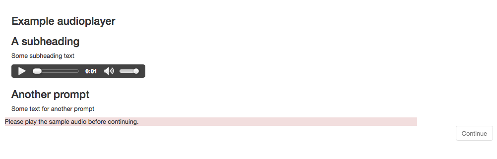
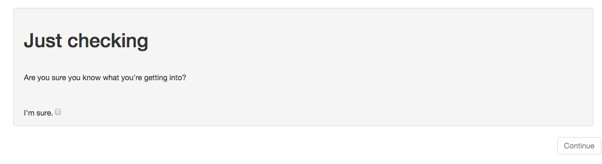

# Glossary of Experimental Components

### exp-audioplayer

##### example


```json
{
    "kind": "exp-audioplayer",
    "autoplay": false,
    "fullControls": true,
    "mustPlay": true,
    "images": [],
    "prompts": [{
        "title": "Instead of a consent form...",
        "text": "Here's a helpful tip."
    }, {
        "title": "A horse is a horse",
        "text": "But please don't say that backwards."
    }],
    "sources": [{
        "type": "audio/ogg",
        "src": "horse.ogg"
    }]
}
```

##### parameters

- **autoplay**: whether to autoplay the audio on load
  - type: true/false
  - default: true
- **fullControls**: whether to use the full player controls. If false, display a single button to play audio from the start.
  - type: true/false
  - default: true
- **mustPlay**: should the user be forced to play the clip before leaving the page?
  - type: true/false
  - default: true
- **sources**: list of objects specifying audio src and type
  - type: list
  - default: empty
- **title**:  a title to show at the top of the frame
  - type: text
  - default: empty
- **titlePrompt**: a title and description to show at the top of the frame. Should have a 'title' and 'text' property
  - type: object
  - default empty
- **images**: List of objects specifying image src, alt, and title
  - type: list
  - default: empty
- **prompts**: Text of any header/prompt pararaphs to show the user. Should contain objects with 'title' and 'text' properties
  - type: list
  - default: empty

##### data

- **didFinishSound**: did the use play through the sound all of the way?
  - type: true/false

- - -

### exp-consent

##### example



```json
{
    "kind": "exp-consent",
    "title": "Just checking",
    "body": "Are you sure you know what you're getting into?",
    "consentLabel": "I'm sure."
}
```

##### parameters

- **title**: a title for the consent form
  - type: text
  - default: 'Notice of Consent'
- **body**: body text for the consent form
  - type: text
  - default: 'Do you consent to take this experiment?'
- **consentLabel**: a label next to the consent form checkbox
  - type: text
  - default: 'I agree'

##### data

- **consentGranted**: did the user grant consent?
  - type: true/false

- - -

### exp-lookit-overview

##### parameters

- a
- b

##### data

- a
- b

- - -

### exp-mood-questionnaire

##### parameters

- a
- b

##### data

- a
- b

- - -

### exp-physics-info

##### parameters

- a
- b

##### data

- a
- b

- - -

### exp-physics-pre-video

##### parameters

- a
- b

##### data

- a
- b

- - -

### exp-survey

##### parameters

- a
- b

##### data

- a
- b

- - -

### exp-video-config

##### parameters

- a
- b

##### data

- a
- b

- - -

### exp-video-consent

##### parameters

- a
- b

##### data

- a
- b

- - -

### exp-video-preview

##### parameters

- a
- b

##### data

- a
- b

- - -

### exp-video-record

##### parameters

- a
- b

##### data

- a
- b

- - -

### exp-video-setup

##### parameters

- a
- b

##### data

- a
- b
